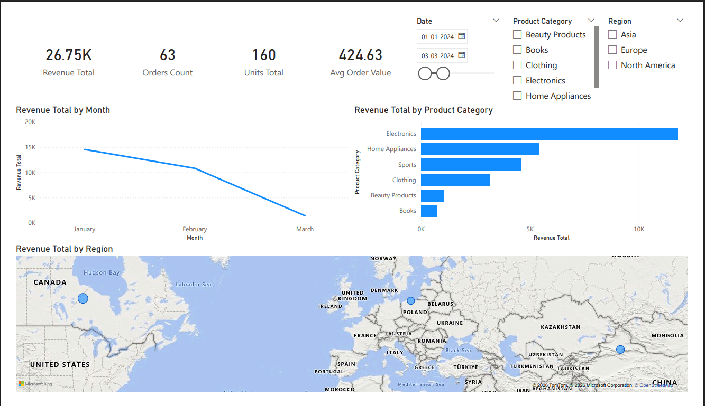
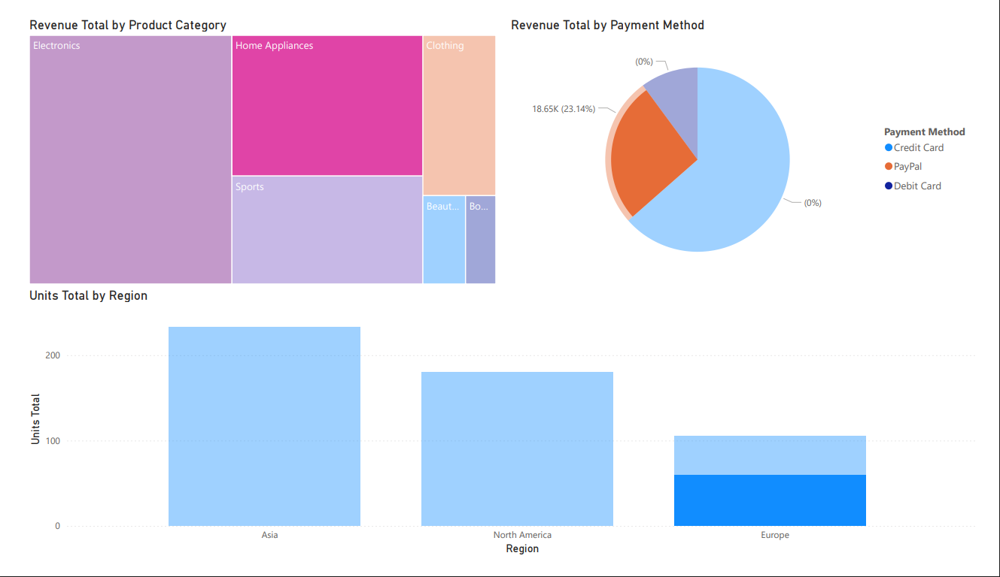

# E-Commerce Sales Power BI Dashboard

## Business Problem
Identify which product categories, regions, and payment methods
drive the most revenue for a global e-commerce business.

## Tools Used
Power BI Desktop | DAX Measures | Interactive Slicers

## Key Business Insights
- Electronics is the highest revenue category by significant margin
- Credit Card accounts for 63.5% of all transactions
- Asia leads in units sold across all regions
- Revenue peaked in January and March 2024

## Business Recommendations
1. Increase Electronics inventory — highest revenue driver
2. Prioritise Credit Card payment optimisation — dominant payment method  
3. Expand Asia market — highest volume region
4. Investigate May–July revenue dip — possible seasonal issue

## Dashboard Preview

## Files
- `Ecommerce_Sales_Dashboard.pbix` — Open with Power BI Desktop
- `Ecommerce_Sales_Dashboard.pdf` — Dashboard export (2 pages)
